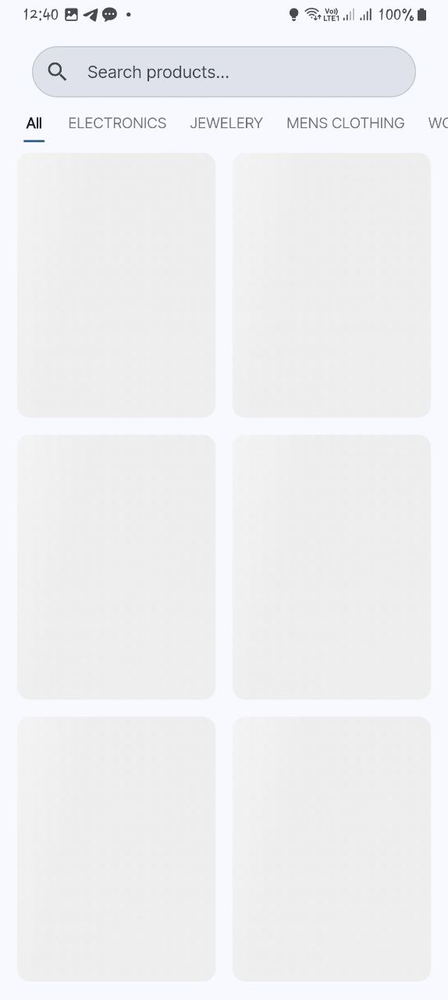
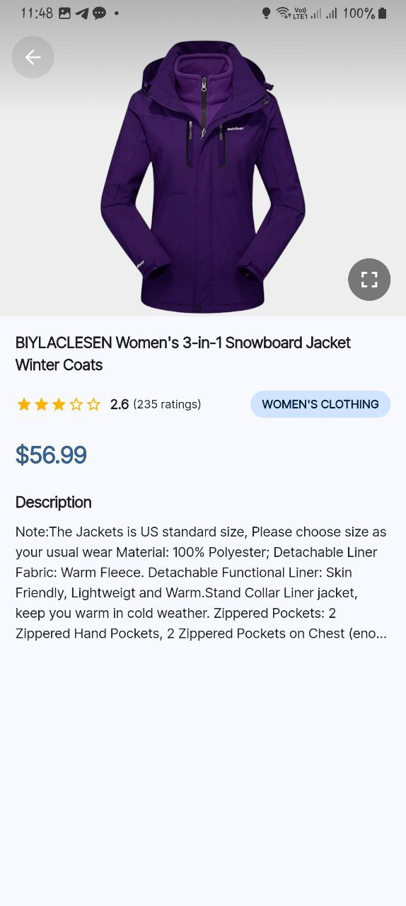
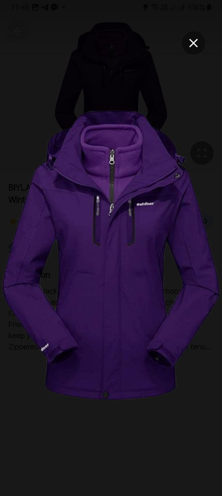

# Mini Catalog – Flutter + BLoC Product Experience

Mini Catalog is a one-day assessment project intentionally engineered as a production-ready reference for Flutter, Clean Architecture, and BLoC. It delivers a polished shopping catalogue experience with search, category filters, pagination, offline caching, and detailed product views while showcasing a maintainable, testable code base.

<p align="center">
   <strong>Key pillars</strong>: Clean architecture • BLoC state management • Offline-first mindset • Material&nbsp;3 UX • Exhaustive testing
</p>

---

## Table of contents

1. [Feature highlights](#feature-highlights)
2. [Architecture at a glance](#architecture-at-a-glance)
3. [Codebase structure](#codebase-structure)
4. [State management & flows](#state-management--flows)
5. [Data layer & caching strategy](#data-layer--caching-strategy)
6. [UX decisions & visual design](#ux-decisions--visual-design)
7. [Testing strategy](#testing-strategy)
8. [Runbook](#runbook)
9. [Configuration & environments](#configuration--environments)
10. [Known limitations & trade-offs](#known-limitations--trade-offs)
11. [UI samples](#ui-samples)
12. [Future enhancements](#future-enhancements)
13. [Contributing](#contributing)

---

## Feature highlights

- **Responsive catalogue grid** populated from the Fake Store API or cached data.
- **Search that feels smart**: 400 ms debounced queries scored by relevance (full-word matches outrank fuzzy matches).
- **Composable filters**: category chips and search combine seamlessly, including when offline.
- **Infinite scroll + pull-to-refresh** with clear differentiation between initial load and “load more”.
- **Offline-first fallback**: first-page cache, category cache, and per-product cache stored via `SharedPreferences`.
- **Detail view** with imagery, pricing, description, and metadata.
- **Modern Material 3 interface** with shimmer placeholders, staggered entrance animations, and snack-bar driven recoveries.
- **Robust error handling**: network awareness, retry affordances, and unobtrusive status messaging.

---

## Architecture at a glance

```
┌──────────┐      ┌──────────────┐      ┌─────────────┐
│ Widgets  │ ───▶ │  BLoC / Cubit│ ───▶ │    Use /    │
│ + Routes │      │  (Presentation│      │ Repository  │
└──────────┘      │    Layer)     │      │   (Domain)  │
                           └──────┬───────┘      └──────┬──────┘
                                     │                    │
                                     ▼                    ▼
                         ┌──────────────┐     ┌──────────────────┐
                         │ Local Source │     │ Remote Source     │
                         │ SharedPrefs  │     │ Dio + FakeStore   │
                         └──────────────┘     └──────────────────┘
```

- **Presentation** is driven by `flutter_bloc`, keeping UI reactive and declarative.
- **Domain** uses repository interfaces (`ProductRepository`) to decouple features from data implementations.
- **Data** coordinates online/offline decisions, applies filtering/pagination, and persists cached snapshots.
- **Dependency injection** is provided by `GetIt` (`lib/injection_container.dart`), enabling effortless test doubles.

---

## Codebase structure

```
lib/
├─ app/                 # MaterialApp, theme, and route wiring
├─ core/                # Constants, errors, network info, reusable widgets
│  ├─ constants/
│  ├─ errors/
│  ├─ network/
│  └─ utils/
├─ features/
│  ├─ catalog/
│  │  ├─ data/          # Remote/local data sources, models, repository impl
│  │  ├─ domain/        # Entities + repository contracts
│  │  └─ presentation/  # Pages, widgets, blocs
│  └─ product_detail/
│     └─ presentation/  # Detail BLoC + UI
└─ injection_container.dart

test/
├─ features/catalog/presentation/blocs/     # bloc_test suites
├─ features/catalog/presentation/pages/     # widget tests
├─ helpers/                                 # shared test utilities
└─ widget_test.dart                         # higher-level smoke/integration tests
```

---

## State management & flows

### Catalog flow

`CatalogBloc` orchestrates list retrieval, pagination, and user intents. Key events include:

- `CatalogStarted` → primes cache, fetches categories + first page.
- `CatalogQueryChanged` → debounced search, resets pagination, updates results.
- `CatalogCategoryChanged` → toggles category filters, integrates with search term.
- `CatalogLoadMore` → paginated fetch with `hasMore` safeguards & loading spinners.
- `CatalogRefreshed` / `CatalogRetryRequested` → refresh/pull-to-refresh & recover from errors.

The bloc state tracks `status`, `products`, `page`, `hasMore`, `query`, selected category, inline `snackbarMessage`, and `isLoadingMore`. Failure cases degrade gracefully: if we already have data and the network fails, a snackbar surfaces the issue without dumping the list.

### Product detail flow

`ProductDetailBloc` performs a deterministic fetch per `productId`. Results are cached so revisiting a product while offline uses the saved snapshot. Errors surface through the same bloc-driven pattern, allowing retry actions.

### Search intelligence

Both remote and cached search use a relevance score:

1. Exact title matches
2. Starts-with matches
3. Whole-word matches within title
4. Substring matches in title
5. Exact/partial category matches
6. Description relevance

Only products within one score of the top hit survive, ensuring focused results.

---

## Data layer & caching strategy

| Concern             | Online path                                                                 | Offline path                                                                  |
|--------------------|------------------------------------------------------------------------------|-------------------------------------------------------------------------------|
| Products list      | `ProductRemoteDataSource.getProducts` → local pagination → cache first page | `ProductLocalDataSource.getCachedProducts` → filter + paginate locally        |
| Categories         | Remote fetch + sanitise (trim/unique/sort) → cache                          | Read cached list → fallback to deriving from cached products if necessary    |
| Product detail     | Fetch by ID → cache json snapshot                                           | Serve cached product by key                                                   |

Implementation notes:

- Remote requests use `dio` with dedicated error mapping to `Failure` types (`NetworkFailure`, `ServerFailure`).
- `SharedPreferences` stores JSON payloads for lists and per-product snapshots.
- `Connectivity` is checked one time per request through `NetworkInfo`, preventing fragile ping loops.
- Pagination is kept client-side (Fake Store API limitation). `_paginateProducts` performs safe sub-list slicing.

---

## UX decisions & visual design

- **Material 3** color scheme and typography with light/dark support.
- **Custom search bar** integrates search history chips via `SearchHistoryStorage` (persisted locally).
- **Category chips** reflect current selection, with quick toggle to refresh or clear.
- **Animated grid** (`flutter_staggered_animations`) creates a smooth, lively catalogue.
- **Loading states**:
   - Global loading → `LoadingWidget` grid shimmer.
   - Infinite scroll → inline circular spinner below grid.
- **Error surface**: `ErrorDisplayWidget` centralises messaging, offers “Try Again”, and respects bottom insets.
- **Snackbar messaging** for transient connectivity hiccups (with `Retry` action hooked to the bloc).

---

## UI samples

The following screens illustrate the customer journey from discovery through deep inspection, highlighting how the catalogue adapts to user intent.

<div align="center">
   <figure style="margin:0 auto 28px; max-width:260px; text-align:center;">
      
      <figcaption><strong>Catalog overview:</strong> Responsive grid with animated entry, inline availability cues, and quick access to filter chips.</figcaption>
   </figure>
   <figure style="margin:0 auto 28px; max-width:260px; text-align:center;">
      
      <figcaption><strong>Precision search:</strong> Debounced, relevance-ranked results with persisted history chips for one-tap recall.</figcaption>
   </figure>
   <figure style="margin:0 auto 28px; max-width:260px; text-align:center;">
      
      <figcaption><strong>Category skimmer:</strong> Layered filter sheet that blends with the grid while keeping context visible.</figcaption>
   </figure>
   <figure style="margin:0 auto 28px; max-width:260px; text-align:center;">
      
      <figcaption><strong>Detail deep dive:</strong> Rich content layout featuring hero imagery, pricing, narrative copy, and calls to action.</figcaption>
   </figure>
   <figure style="margin:0 auto 0; max-width:260px; text-align:center;">
      
      <figcaption><strong>Image lightbox:</strong> Edge-to-edge media viewer for high-resolution imagery that supports pinch-and-pan gestures.</figcaption>
   </figure>
</div>

---

## Testing strategy

| Layer      | Tooling              | Coverage highlights                                                           |
|------------|----------------------|-------------------------------------------------------------------------------|
| BLoC       | `bloc_test`, `mocktail` | Startup sequence, error paths, debounced search, pagination success/failure, offline snackbar behaviour |
| Widgets    | `flutter_test`          | Catalogue screen transitions (loading → data → error), empty state rendering |
| Integration| Custom smoke tests      | Whole-app widget test (`test/widget_test.dart`) ensures wiring and DI remain healthy |

All tests are deterministic thanks to dependency injection: network, repositories, and storage can be mocked or faked.

---

## Runbook

### Prerequisites

- Flutter **3.32.0+** (project developed against 3.32.7)
- Dart **3.8.1** (bundled with Flutter toolchain)
- Android SDK / Xcode for respective platforms
- Optional: iOS/macOS runners require macOS with CocoaPods installed

### Setup

```bash
git clone https://github.com/abeelgetahun/catalog_x.git
cd catalog_x
flutter pub get
```

### Launch

```bash
# choose one of the supported targets
flutter run        # auto-detects connected device or emulator
```

### Test

```bash
flutter test                                # run entire suite
flutter test --coverage                     # collect coverage (optional)
flutter test test/features/.../catalog_bloc_test.dart
flutter test test/features/.../catalog_page_test.dart
```

> The default `test/widget_test.dart` has been repurposed into a higher-level smoke suite that spins up the DI container; ensure `flutter pub run build_runner` is **not** required—everything is runtime-configured.

---

## Configuration & environments

- **API base URL** lives in `core/constants/api_constants.dart`. Swap endpoints via environment-specific constants if integrating with other backends.
- **Search debounce** tuned in the same constants file (`Duration(milliseconds: 400)`).
- **Pagination size** defaults to 20; adapt `ApiConstants.pageSize` to change client-side slicing globally.
- **Dependency injection**: `lib/injection_container.dart` centralises registrations. Call `await init()` before running the app (handled in `main.dart`).

---

## Known limitations & trade-offs

| Constraint | Rationale | Potential mitigation |
|------------|-----------|----------------------|
| Client-side pagination only | Fake Store API does not expose page params | Replace data source or wrap API behind custom service that supports server-side paging |
| Cached scope limited to first page | Avoids uncontrolled local storage growth | Extend caching shallow copies of subsequent pages or leverage Hive for structured persistence |
| Search limited by loaded products when offline | Offline mode relies on cached first page | Persist wider catalogue or pre-fetch additional pages when bandwidth allows |
| Image fetch requires network at least once | Images aren’t bundled locally | Provide local placeholders, integrate with `cached_network_image` offline store, or ship base64 fallbacks |

---

## Future enhancements

- Persisted wish list / favourites with local storage sync.
- Cart & checkout exploration to exercise additional state machines.
- Dynamic theming toggle with user preference persistence.
- Product comparison view and richer filtering (price range, ratings).
- Observability hooks (Sentry/Crashlytics) and in-app analytics for search success.
- Integration tests using `integration_test` package for full navigation scenarios.

---

## Contributing

1. Fork the repo and create a feature branch: `git checkout -b feature/amazing-improvement`.
2. Keep the architecture contract intact (presentation ↔ domain ↔ data layers).
3. Add or update tests alongside your changes.
4. Run `flutter test` and ensure no analyzer warnings are introduced.
5. Submit a pull request describing intent, decisions, and test evidence.

---

### License

This project is released under the MIT License. See [LICENSE](LICENSE) for details.

---

Built with care to demonstrate a clean, professional, and scalable Flutter code base within one business day.